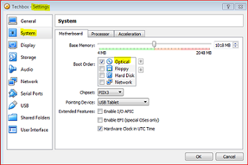

# Debootstrap-Minimal
Install Ubuntu-16.04.4, Minimal.
================================
-   Load ubuntu-mate-16.04.4-desktop-i386 with
Oracle Virtual Box Wm
-   Setup Oracle VM VirtualBox:
-   It is understood that you are connected to the internet.
-   Oracle VM VirtualBox => Manager => Settings => System =>:
-   
-   Oracle VM VirtualBox => Manager => Settings => Storage =>:
-   
-   Run setup 
-   Do not install, start the section   
-   
*   Applications => System Tools => MATE Terminal:
-   

-   $ sudo apt-get update
-   $ sudo apt-get install --no-install-recommends git
-   $ sudo apt-get install --no-install-recommends debootstrap
-   $ sudo passwd
-   password config
-   password confirm
-   $ ctrl +alt + F1
-   Start as root

-   $ cfdisk /dev/sda
-   Select label type: [dos]
-   Select option: [new]
-   Partition size:532M
-   [Primary}
-   Select option [new]
-   Partition size:3G
-   [Primary}
-   Select option [new]
-   Partition size:503M
-   [Primary}
-   Add [Type] /dev/sda1 =>b W95 VFAT32
-   Add [Bootable] /dev/sda1
-   Add [Type] /dev/sda3 =>82 LINUX SWAP/SOLARIS
-   [Write]
-   [Quit]
-   

-   $ mkswap /dev/sda3
-   $ mkfs.ext4 /dev/sda2
-   $ mkfs.vfat /dev/sda1
-   $ mkdir -p /target 
-   $ mount -t ext4 -o rw /dev/sda2 /target
-   $ cd /target 
-   $ debootstrap --variant=minbase xenial /target 
-   $ mount -t vfat -o rw /dev/sda1 /target/boot
-   $ cd /target/root
-   $ git clone https://github.com/Ivan-Carlos/Debootstrap-Minimal
-   $ cd ..
-   $ mv /target/etc/apt/sources.list /target/etc/apt/sources.list.bk
-   $ cp -a /etc/apt/sources.list /target/etc/apt/
-   $ nano /target/etc/apt/sources.list
-   Coment first line with #
-   deb cdrom:[Ubuntu-Mate 16.04.4 LTS_Xenial Xerus_$
-   ctrl + x
-   y + enter  

-   $ chmod a+x /target/root/Debootstrap-Minimal/chroot-wrapper.sh
-   $ /target/root/Debootstrap-Minimal/chroot-wrappper.sh /target 
-   $ apt-get update
-   $ apt-get install --no-install-recommends netbase 
-   $ apt-get install --no-install-recommends apt-utils dialog
-   $ apt-get install --no-install-recommends iputils-ping
-   $ apt-get install --no-install-recommends apt-file
-   $ apt-file update
-   $ apt-file search bin/ifconfig
-   $ apt-get install --no-install-recommends net-tools
-   $ apt-get install --no-install-recommends ifupdown
-   $ apt-get install --no-install-recommends isc-dhcp-client
-   $ apt-get install --no-install-recommends resolvconf
-   $ apt-get install --no-install-recommends nano
-   $ apt-get install --no-install-recommends network-manager
-   $ hostname
-   $ nano /etc/hosts
-   127.0.0.1 localhost
-   127.0.1.1 ubuntu-mate
-   ctrl + x
-   y + enter

-   $ apt-get install --no-install-recommends sudo
-   $ adduser user
-   Adding user `user' ...
-   Adding new group `ivan' (1000) ...
-   Adding new user `ivan' (1000) with group `ivan' ...
-   Creating home directory `/home/ivan' ...
-   Copying files from `/etc/skel' ...
-   Enter new UNIX password: 
-   Retype new UNIX password: 
-   passwd: password updated successfully
-   Changing the user information for ivan
-   Enter the new value, or press ENTER for the default
-   Full Name [ ]: user
-   Room Number [ ]: enter
-   Work Phone [ ]: enter
-   Home Phone [ ]: enter
-   Other [ ]: enter
-   Is the information? correct [Y/n}: y

-   $ apt-get autoclean
-   $ usermod -a -G sudo user
-   $ groups user
-   user : user sudo

-   $ blkid > fstab
-   $ nano /etc/fstab
-   ctrl + k
-   ctrl + r
-   type:/root/fstab
-   #/dev/sda2
-   UUID=**************************** /ext4 errors=remount-ro 0 1
-   #/dev/sda1
-   UUID=**************************** /boot vfat default 0 2
-   #/dev/sda3
-   UUID=**************************** none swap sw 0 0
-   ctrl + x
-   y + enter
-   

-   Remember: You are in this Virtual Box Wm, if it is not, the following step can cause problems in your boot.

-   $ apt-get install --no-install-recommends initramfs-tools linux-image-extra-4.4.0.21-generic grub-pc

-   In the box grub-pc make the first two options

-   $ passwd
-   password config
-   password confirm

-   Optional
-   $ update-initramfs -u -k all
-   $ shutdown -r now

